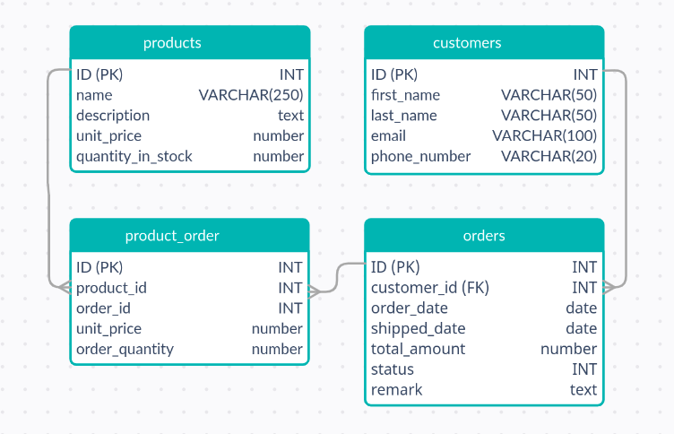

# Order Processing App

> In this project, a rails order processing app that can handle creating, reading, updating and deleting products, customers and orders for a fictious order processing company is developed.

> ## ER Diagram
> 

## Built With

- Ruby
- Ruby on Rails
- PostgreSQL

## Live Demo

 [live link](https://order-processing-tek.herokuapp.com/)

## Getting Started

To get a local copy up and running follow these simple example steps.

>- Run `git clone https://github.com/gtekle/order-processing.git`
>- Run `cd order-processing` to change to project root directory
>- Run `bundle install`
>- Run `rails db:create`
>- Run `rails db:migrate`
>- Run `npm install`
>- Run `rails s` to run the app
>- Opn `http://localhost:3000/` on your browser

### Prerequisites
- Text Editor (e.g. VS Code, Sublime text)
- Git
- Node.js

### Setup

### Install
- Ruby
- Rails
- PostgreSQL

### Usage

### Run tests
- Run `$ bundler exec rspec spec`

### Deployment
- Run `$ heroku login`
- Run `$ heroku create`
- Run `$ git push heroku development:main`
- Run `$ heroku run rails db:migrate`
- Run `$ heroku open` to open the deployed app
- Run `$ heroku logs -t` to see deployment log

## Author

👤 **Tekle Gebreyohannes**

- GitHub: [@gtekle](https://github.com/gtekle)
- LinkedIn: [LinkedIn](https://linkedin.com/in/gtekle)

## 🤝 Contributing

Contributions, issues, and feature requests are welcome!

Feel free to check the [issues page](../../issues/).

## Show your support

Give a ⭐️ if you like this project!

## Acknowledgments

- [Microverse](https://www.microverse.org/)

## 📝 License

This project is [MIT](./MIT.md) licensed.